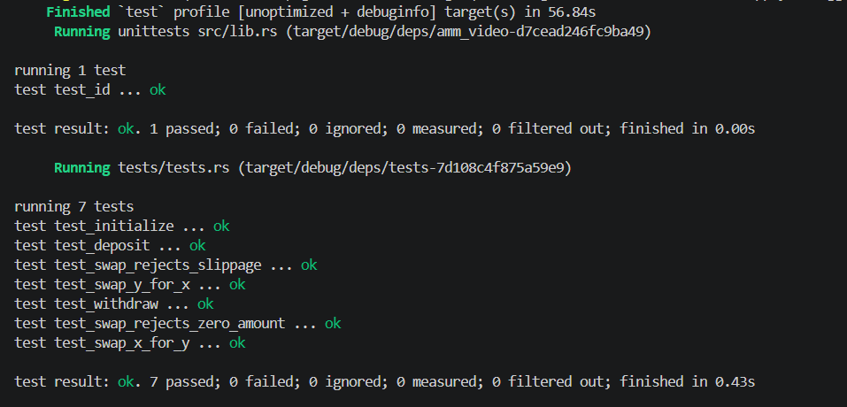

# Solana Automated Market Maker (AMM) Program

A constant-product Automated Market Maker ($x \cdot y = k$) built on Solana using the Anchor framework and `anchor-spl` token interfaces. The program supports dynamic pool creation, proportional liquidity provision, LP token minting/burning, atomic token swaps with slippage protection, and protocol fee routing to a dedicated treasury.

---

## Overview

The AMM program facilitates decentralized token swaps between arbitrary SPL token pairs:

1. **Pool Initialization**: Derives a pool configuration PDA, creates token vault ATAs, and initializes a dedicated LP mint controlled by the pool PDA.
2. **Liquidity Provision**: Liquidity providers deposit Token X and Token Y into the pool vaults and receive newly minted LP tokens representing proportional pool ownership.
3. **Liquidity Withdrawal**: Users burn LP tokens to redeem their underlying share of Token X and Token Y reserves.
4. **Token Swapping**: Traders swap Token X for Token Y (or vice-versa) based on constant-product pricing. Swap fees are split equally ($50/50$) between liquidity pool growth and the protocol treasury.

---

## Program Details

- **Program ID**: `6KoUjko5kqLHaF31gdWGBihf8Pw8dUNte2hBpBEJveVe`
- **Framework**: Anchor (Rust)
- **Curve Math**: Constant Product Invariant ($x \cdot y = k$) via `constant_product_curve`
- **Token Standard**: SPL Token & SPL Token-2022 (`TokenInterface`, `transfer_checked`, `mint_to_checked`, `burn`)

---

## Account Architecture & State

### 1. Config State (`Config`)

The core state account representing a liquidity pool configuration.

| Field | Type | Description |
| :--- | :--- | :--- |
| `seed` | `u64` | Entropy seed enabling multiple independent pools for identical token pairs |
| `authority` | `Option<Pubkey>` | Optional authority key capable of locking the pool |
| `mint_x` | `Pubkey` | Mint address for Token X |
| `mint_y` | `Pubkey` | Mint address for Token Y |
| `fee` | `u16` | Swap fee basis points (e.g., 100 bps = 1%) |
| `locked` | `bool` | Emergency pause flag preventing deposits, withdrawals, and swaps |
| `config_bump` | `u8` | Canonical bump seed for the `Config` PDA |
| `lp_bump` | `u8` | Canonical bump seed for the LP token mint PDA |
| `treasury` | `Pubkey` | Protocol fee recipient address holding treasury ATAs |

### 2. PDA Derivations

- **Config Account PDA**:
  ```text
  seeds = [b"config", seed.to_le_bytes().as_ref()]
  ```
- **LP Token Mint PDA**:
  ```text
  seeds = [b"lp", config_pda.as_ref()]
  ```
- **Vault Token Accounts**:
  Associated Token Accounts for `mint_x` and `mint_y` owned by the `Config` PDA:
  ```text
  authority = config_pda
  mint = mint_x | mint_y
  ```

---

## Instructions

### 1. `initialize`

Creates the pool configuration PDA, derives the LP token mint PDA, initializes vault ATAs for Token X and Token Y, and configures the protocol treasury address.

- **Parameters**: `seed: u64`, `fee: u16`, `authority: Option<Pubkey>`
- **Signer**: Maker (Pool Creator)

### 2. `deposit`

Deposits Token X and Token Y into the pool vaults in exchange for freshly minted LP tokens.

- **Parameters**: `amount: u64` (LP tokens to mint), `max_x: u64`, `max_y: u64`
- **Signer**: Liquidity Provider
- **Logic**:
  - **Genesis Deposit**: Sets initial ratio based on supplied `amount_x` and `amount_y`.
  - **Subsequent Deposits**: Enforces strictly proportional token deposits based on existing pool reserves:
    $$\Delta x = \frac{\Delta L \cdot R_x}{L_{\text{supply}}}, \quad \Delta y = \frac{\Delta L \cdot R_y}{L_{\text{supply}}}$$
  - **Slippage Check**: Validates that required input amounts satisfy `max_x >= x` and `max_y >= y`.

### 3. `withdraw`

Burns user LP tokens and returns proportional amounts of Token X and Token Y from the vaults.

- **Parameters**: `amount: u64` (LP tokens to burn), `min_x: u64`, `min_y: u64`
- **Signer**: Liquidity Provider
- **Logic**:
  - Computes redeemable amounts using the constant product curve.
  - Verifies output amounts satisfy `x >= min_x` and `y >= min_y`.
  - Burns LP tokens and transfers Token X and Token Y via PDA-signed CPI.

### 4. `swap`

Executes a constant-product token swap between Token X and Token Y with slippage verification and protocol fee distribution.

- **Parameters**: `is_x: bool` (true if depositing X to receive Y), `amount_in: u64`, `min_amount_out: u64`
- **Signer**: Trader
- **Fee Routing**:
  - Total swap fee is computed from basis points (`config.fee`).
  - **50% of the fee** is sent to the protocol treasury ATA (`treasury_x` or `treasury_y`).
  - **50% of the fee** remains in the pool vault, compounding liquidity provider returns.
- **Slippage Protection**: Reverts if the output token amount is less than `min_amount_out`.

---

## Project Structure

```text
amm_q3_26/
├── Anchor.toml
├── Cargo.toml
├── programs/
│   └── amm-video/
│       ├── Cargo.toml
│       ├── src/
│       │   ├── lib.rs                  # Program entrypoint & instruction dispatch
│       │   ├── state.rs                # Config account structure
│       │   ├── error.rs                # Custom AMM error definitions
│       │   ├── constants.rs            # Constant definitions
│       │   ├── instructions.rs
│       │   └── instructions/
│       │       ├── mod.rs
│       │       ├── initialize.rs       # Pool & LP mint initialization
│       │       ├── deposit.rs          # Liquidity deposit & LP minting
│       │       ├── withdraw.rs         # Liquidity withdrawal & LP burning
│       │       └── swap.rs             # Constant product swap & fee split
│       └── tests/
│           ├── ix_handlers/            # Instruction builders for LiteSVM
│           └── tests.rs                # Integration test suite
└── proof/
    └── image.png                       # LiteSVM test verification output
```

---

## Building and Testing

### Prerequisites

- Rust `1.75.0+`
- Solana CLI `1.18+`
- Anchor CLI `0.30.1`

### Build

```bash
anchor build
```

### Test

Unit and integration tests are executed using `litesvm` and `litesvm-token` for fast, validator-free SBPF execution:

```bash
cargo test --package amm-video
```

### Test Coverage

- `test_initialize`: Verifies `Config` account state, PDA derivations, and LP mint authority.
- `test_deposit`: Validates genesis liquidity addition, reserve updates, and LP token minting.
- `test_withdraw`: Validates proportional token redemption, LP burning, and residual reserve calculations.
- `test_swap_x_for_y`: Tests token swap execution, curve math, vault reserve updates, and 50/50 fee routing to the treasury.
- `test_swap_y_for_x`: Tests inverse token swap execution and treasury fee accrual for Token Y.
- `test_swap_rejects_slippage`: Ensures transactions exceeding slippage bounds fail.
- `test_swap_rejects_zero_amount`: Asserts that zero-amount input swaps are rejected.

---

## Execution & Test Proof

All integration tests successfully pass against the compiled AMM program binary:


